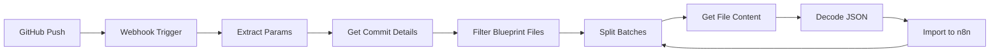

# GitHub → n8n Auto-Import Setup Guide

## Overview

This workflow automatically imports blueprint workflows from your GitHub repository into n8n whenever you push changes. It's perfect for CI/CD pipeline integration and keeping n8n workflows in sync with version control.

## Features

- 🔄 **Automatic Import**: Push blueprint JSON files to GitHub, they appear in n8n
- 🎯 **Selective Import**: Only processes files in specified blueprint directory
- 📝 **Change Detection**: Imports only added or modified workflows
- 🔐 **Secure**: Uses GitHub API tokens and n8n API authentication
- 🚀 **Batch Processing**: Handles multiple workflow files in a single push

## Quick Setup

### 1. Deploy the Workflow

```powershell
# Interactive setup
.\scripts\wizard\deploy-github-auto-import.ps1

# Or with parameters
.\scripts\wizard\deploy-github-auto-import.ps1 `
    -RepositoryUrl "https://github.com/YourOrg/YourRepo" `
    -WebhookPath "github-push" `
    -ShowWebhookSetup
```

### 2. Create Required Credentials in n8n

#### GitHub API Token
1. Go to https://github.com/settings/tokens
2. Generate new token (classic)
3. Select scope: `repo` (full control)
4. Copy the token

In n8n:
- Settings → Credentials → Add Credential
- Type: **Header Auth**
- Name: `github-api`
- Header Name: `Authorization`
- Header Value: `Bearer YOUR_GITHUB_TOKEN`

#### n8n API Key
1. In n8n: Settings → API
2. Create API Key
3. Copy the key

In n8n:
- Settings → Credentials → Add Credential
- Type: **Header Auth**
- Name: `n8n-api`
- Header Name: `X-N8N-API-KEY`
- Header Value: `YOUR_N8N_API_KEY`

### 3. Configure GitHub Webhook

1. Go to your repository: `Settings → Webhooks → Add webhook`
2. Configure:
   - **Payload URL**: `http://your-n8n-url/webhook/github-push`
   - **Content type**: `application/json`
   - **Secret**: (optional, for added security)
   - **Events**: Select "Just the push event"
   - **Active**: ✓ Check

3. Click "Add webhook"

## Workflow Architecture



## Configuration Parameters

| Parameter | Description | Default |
|-----------|-------------|---------|
| `WEBHOOK_PATH` | Webhook endpoint path | `github-push` |
| `DEFAULT_BRANCH` | Fallback branch name | `main` |
| `BLUEPRINTS_PATH` | Directory containing blueprints | `blueprints/` |
| `N8N_BASE_URL` | Your n8n instance URL | `http://localhost:5678` |
| `GITHUB_CREDENTIAL_ID` | GitHub API credential name | `github-api` |
| `N8N_API_CREDENTIAL_ID` | n8n API credential name | `n8n-api` |

## Repository Structure

Your GitHub repository should have blueprints organized like:

```
your-repo/
├── blueprints/
│   ├── basic/
│   │   ├── workflow1.json
│   │   └── workflow2.json
│   ├── integrations/
│   │   ├── slack-notify.json
│   │   └── email-automation.json
│   └── manifest.json
├── scripts/
└── README.md
```

## Testing the Integration

### 1. Manual Test
```bash
# Create a test blueprint
echo '{"name":"Test Workflow","nodes":[]}' > blueprints/test.json

# Commit and push
git add blueprints/test.json
git commit -m "Add test workflow"
git push
```

### 2. Check n8n
- Go to n8n Executions
- Verify the webhook was triggered
- Check if "Test Workflow" appears in workflows

### 3. GitHub Webhook Deliveries
- Repository Settings → Webhooks → Your webhook → Recent Deliveries
- Check for green checkmarks (successful deliveries)

## Security Best Practices

### 1. Use Production URLs
For production, use HTTPS:
```
https://your-n8n-domain.com/webhook/github-push
```

### 2. Add Webhook Secret
In GitHub webhook settings, add a secret. Then update n8n webhook node to validate it.

### 3. Restrict API Permissions
Create GitHub tokens with minimal required permissions (just `repo` scope).

### 4. IP Whitelisting
If possible, whitelist GitHub's webhook IP ranges in your firewall.

## Troubleshooting

### Webhook Not Triggering
- Check webhook is active in GitHub settings
- Verify n8n workflow is activated
- Check Recent Deliveries in GitHub webhook settings

### Authentication Errors
- Verify GitHub token hasn't expired
- Check n8n API key is correct
- Ensure credentials are properly named in n8n

### Files Not Importing
- Verify files are in correct path (`blueprints/` by default)
- Check files are valid JSON
- Look at n8n execution logs for errors

### Network Issues
- Ensure n8n is accessible from internet (for GitHub webhooks)
- Check firewall rules
- Verify n8n webhook URL is correct

## Advanced Configuration

### Custom Blueprint Validation
Add validation node after "Decode & Parse JSON":
```javascript
// Validate workflow has required fields
if (!$json.workflow.name) {
  throw new Error('Workflow missing name');
}
if (!$json.workflow.nodes || $json.workflow.nodes.length === 0) {
  throw new Error('Workflow has no nodes');
}
return items;
```

### Notification on Import
Add Slack/email notification after successful import:
```javascript
// After import success
const message = `✅ Imported: ${$json.workflow.name}`;
// Send to Slack, email, etc.
```

### Environment-Specific Imports
Filter by branch for different environments:
```javascript
const branch = $json.branch;
if (branch === 'production') {
  // Import to production n8n
} else if (branch === 'staging') {
  // Import to staging n8n
}
```

## Monitoring

### Set Up Alerts
1. Add error handling nodes
2. Send notifications on import failures
3. Log all imports to Google Sheets or database

### Metrics to Track
- Number of workflows imported per day
- Failed imports and reasons
- Most frequently updated workflows
- Time taken for imports

## Integration with CI/CD

### GitHub Actions Example
```yaml
name: Deploy Workflows
on:
  push:
    paths:
      - 'blueprints/**/*.json'
    branches:
      - main

jobs:
  notify-n8n:
    runs-on: ubuntu-latest
    steps:
      - name: Trigger n8n Import
        run: |
          curl -X POST ${{ secrets.N8N_WEBHOOK_URL }} \
            -H "Content-Type: application/json" \
            -d '{"ref":"refs/heads/main"}'
```

## Support

For issues or questions:
1. Check n8n execution logs
2. Review GitHub webhook Recent Deliveries
3. Verify all credentials are correct
4. Check network connectivity

---

*Last Updated: 2025-09-18*