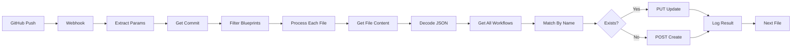

# GitHub → n8n Auto-Sync (Upsert) Setup Guide

## Overview

This enhanced workflow provides intelligent synchronization between GitHub and n8n, using an upsert pattern to update existing workflows or create new ones based on workflow name matching.

## Key Differences from Auto-Import

| Feature | Auto-Import | Auto-Sync (Upsert) |
|---------|------------|-------------------|
| **Duplicate Prevention** | ❌ Creates new workflows | ✅ Updates existing workflows |
| **Name Matching** | Not implemented | Matches by workflow name |
| **Activation Status** | Always inactive | Preserves existing status |
| **Operation Type** | POST only | PUT (update) or POST (create) |
| **Workflow IDs** | Always new | Preserves existing IDs |

## Features

- 🔄 **Smart Sync**: Updates existing workflows, creates new ones
- 🎯 **Name-Based Matching**: Identifies workflows by name
- 📝 **Preserves Settings**: Maintains activation status and IDs
- 🔐 **Secure**: Uses GitHub and n8n API authentication
- 🚀 **No Duplicates**: Prevents workflow proliferation

## Quick Setup

### 1. Deploy the Workflow

```powershell
# Interactive setup with comparison
.\scripts\wizard\deploy-github-auto-sync.ps1 -ShowComparison

# Or direct deployment
.\scripts\wizard\deploy-github-auto-sync.ps1 `
    -RepositoryUrl "https://github.com/YourOrg/YourRepo" `
    -WebhookPath "github-sync"

# Use import-only mode (original behavior)
.\scripts\wizard\deploy-github-auto-sync.ps1 -UseImportOnly
```

### 2. Create Required Credentials

Same as Auto-Import setup:

#### GitHub API Token
- Go to https://github.com/settings/tokens
- Generate new token (classic) with `repo` scope
- In n8n: Header Auth credential
  - Name: `github-api`
  - Header Name: `Authorization`
  - Header Value: `Bearer YOUR_TOKEN`

#### n8n API Key
- In n8n: Settings → API → Create API Key
- Create Header Auth credential
  - Name: `n8n-api`
  - Header Name: `X-N8N-API-KEY`
  - Header Value: `YOUR_KEY`

### 3. Configure GitHub Webhook

1. Repository Settings → Webhooks → Add webhook
2. Configure:
   - **Payload URL**: `http://your-n8n/webhook/github-sync`
   - **Content type**: `application/json`
   - **Events**: Just the push event
   - **Active**: ✓

## Workflow Architecture



## How It Works

### 1. Workflow Detection
```javascript
// Searches all n8n workflows
const allWorkflows = await getAllWorkflows();
const existingMatch = allWorkflows.find(w => w.name === newWorkflow.name);
```

### 2. Update Logic
```javascript
if (existingMatch) {
  // Update: preserve ID and activation
  workflow.id = existingMatch.id;
  workflow.active = existingMatch.active;
  method = 'PUT';
  url = `/api/v1/workflows/${workflow.id}`;
} else {
  // Create: new workflow
  method = 'POST';
  url = '/api/v1/workflows';
}
```

### 3. Status Preservation
- Workflow IDs maintained
- Activation status preserved
- Connections and settings retained
- Only nodes and logic updated

## Configuration Parameters

| Parameter | Description | Default |
|-----------|-------------|---------|
| `WEBHOOK_PATH` | Webhook endpoint | `github-sync` |
| `DEFAULT_BRANCH` | Branch to sync from | `main` |
| `BLUEPRINTS_PATH` | Blueprint directory | `blueprints/` |
| `N8N_BASE_URL` | n8n instance URL | `http://localhost:5678` |
| `GITHUB_CREDENTIAL_ID` | GitHub credential | `github-api` |
| `N8N_API_CREDENTIAL_ID` | n8n credential | `n8n-api` |

## Testing

### 1. Initial Import
```bash
# Create new workflow
echo '{"name":"Test Workflow","nodes":[]}' > blueprints/test.json
git add blueprints/test.json
git commit -m "Add test workflow"
git push
```

### 2. Update Test
```bash
# Modify existing workflow
echo '{"name":"Test Workflow","nodes":[{"type":"n8n-nodes-base.start"}]}' > blueprints/test.json
git commit -am "Update test workflow"
git push
```

### 3. Verify Behavior
- First push: Creates new workflow
- Second push: Updates same workflow (no duplicate)
- Check n8n UI: Only one "Test Workflow" exists

## Use Cases

### Development → Production Sync
```powershell
# Sync from dev branch to dev n8n
.\deploy-github-auto-sync.ps1 `
    -DefaultBranch "develop" `
    -N8nUrl "https://dev.n8n.company.com"

# Sync from main to production
.\deploy-github-auto-sync.ps1 `
    -DefaultBranch "main" `
    -N8nUrl "https://n8n.company.com"
```

### Team Collaboration
- Developers push workflow changes to GitHub
- Changes automatically sync to shared n8n instance
- No duplicate workflows from multiple pushes
- Activation status preserved (won't deactivate production workflows)

### Version Control Benefits
- Track workflow changes in Git
- Code review for workflow modifications
- Rollback capabilities through Git history
- Consistent workflow naming across environments

## Comparison with Import-Only

### When to Use Auto-Import
- Initial workflow deployment
- Creating workflow variations
- Testing different versions
- When duplicates are acceptable

### When to Use Auto-Sync (Upsert)
- Production environments
- Team collaboration
- Continuous deployment
- Maintaining single source of truth
- Preventing workflow sprawl

## Troubleshooting

### Workflow Not Updating
- Verify workflow names match exactly
- Check n8n API permissions
- Review execution logs for errors

### Duplicate Workflows Still Created
- Ensure using sync version, not import
- Check workflow names for trailing spaces
- Verify name matching logic in Function node

### Activation Status Changed
- Sync preserves status by default
- Check if manual override in workflow
- Verify API response includes status

## Advanced Configuration

### Custom Name Matching
```javascript
// In "Match By Name" Function node
const existingMatch = allWorkflows.find(w =>
  w.name.toLowerCase() === wf.name.toLowerCase()
);
```

### Selective Field Updates
```javascript
// Preserve more settings
if (existingMatch) {
  workflowData.id = existingMatch.id;
  workflowData.active = existingMatch.active;
  workflowData.tags = existingMatch.tags;  // Keep tags
  workflowData.settings = existingMatch.settings;  // Keep settings
}
```

### Environment-Based Behavior
```javascript
// Different sync strategies per environment
const isDev = $env.N8N_ENV === 'development';
if (isDev) {
  workflowData.active = false;  // Always inactive in dev
} else {
  workflowData.active = existingMatch?.active || false;
}
```

## Migration from Auto-Import

1. Deploy new sync workflow
2. Update GitHub webhook URL
3. Deactivate old import workflow
4. Clean up duplicate workflows if needed

## Best Practices

1. **Naming Convention**: Use consistent, descriptive workflow names
2. **Testing**: Test in development before production
3. **Monitoring**: Check execution logs regularly
4. **Cleanup**: Remove old duplicate workflows after migration
5. **Documentation**: Document workflow purposes in descriptions

---

*Last Updated: 2025-09-19*